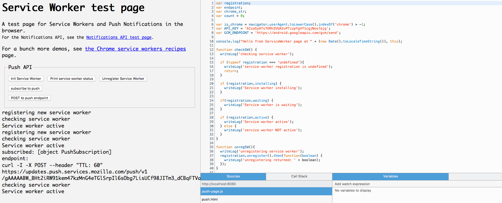

Workers
=====

#### Hello Workers

Hello Workers, is a simple example where you create "Hello" workers, who's job
it is say hello when you tell them too. This is an example of a page that can have many dedicated independent workers.

#### Push Service workers

The Push Service workers example exercises the service workers API. It's possible to register/un-register service workers, make XHR post requests, and subscribe to push notifications.
